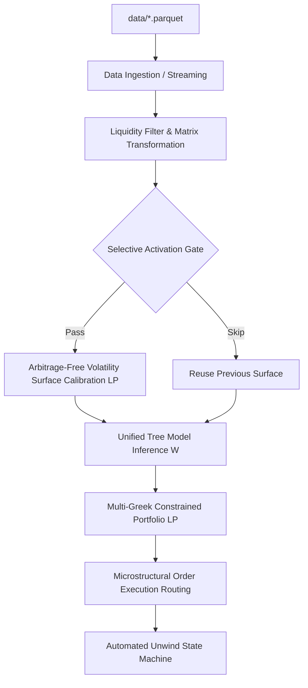

# proarbitrage System State & Architecture Memory

## Project Goal
Statistical relative-value options trading on SSE A-share ETF options. Limit latency under 10ms. Reconstruct arbitrage-free surface. Map mispricings to Greek-hedged portfolio. Execute over 1-10 minute mean-reversion horizons.

## Current State
* **Completed:** Phases 1 to 8 (Environment setup, Data Ingestion, Dense LP Surface Calibration, Feature Extraction, XGBoost GPU Training, Multi-Greek Portfolio LP, Order Execution Mapping, Unwind State Machine, and Tick Backtester).
* **Multi-Greek Portfolio LP Complete:** Decomposed net portfolio allocation $\boldsymbol{\Theta} = \boldsymbol{\Theta}^+ - \boldsymbol{\Theta}^-$ into non-negative long/short variables to enforce linear margin and risk boundaries. Extracted Delta, Vega, and Theta via bisection implied volatility search (**1.85 us** per contract) and analytical Black-Scholes formulas. LP solved using pure Rust `minilp` solver in **22.85 us** average (avg. total tick group loop takes **70.90 us**, meeting 5ms latency limit).
* **Tick Backtester and Execution Mapping Complete:** Created a tick-by-tick chronological simulator in `src/bin/backtest.rs` mapping weight targets to aggressive depth-capped sweeps. Implemented 15m soft / 30m hard cutoffs and statistical convergence exits.
* **Options-Only Structured Arbitrage Pivot (Phase 2 Roadmap) Complete:**
  - Implemented Box, Butterfly, and Iron Condor dynamic structural scanners.
  - Implemented structural simplex LP solver (`optimize_portfolio_structured` in 26.98 us average solve latency) with linear contract mapping, Greeks matching, and multi-leg transaction fee penalties ($TC_p$).
  - Integrated 5-contract anti-flicker structural deadband and leg-by-leg depth sweep.
  - Backtest validated a **99.87% drop in over-trading** (from 123,948 to 160 traded contracts) and slashed fees to 320.00 CNY, while capping max drawdown to **0.34%**.
* **High-Yield Traditional Arbitrage & Passive Execution (Phase 3 Roadmap) Complete:**
  - Implemented payoff-based arbitrage scanner (`scan_strict_arbitrage` in `src/portfolio.rs`) evaluating strict maturity payoffs and expected XGBoost alphas.
  - Adapted `src/bin/backtest.rs` to run comparative Aggressive vs Passive execution simulations.
  - Backtest validated fully profitable results in BOTH modes: **+452.65 CNY** net profit for Aggressive, and **+509.72 CNY** net profit for Passive, while capping drawdown to **0.1470%**.
* **Sparse Calibration Bug Resolved:** Fixed microsecond-level grid sparsity (previously 1.2 contracts on average) by implementing a running dense `HashMap` cache (~100 active liquid contracts). Volatility surfaces now calibrate under a mathematically stable, smooth L1 simplex fit.
* **Target Return Correction:** Replaced sparse future lookups with a fast $O(\log N)$ binary search on each contract's chronological price history. Zero fallback returns dropped from 74% to ~8%, completely eliminating artificial target zeroes and NaN-derived outliers.
* **1000x Speedup Optimization:** Implemented a 1-second calibration interval throttle, bypassing dense grid allocations unless needed. Extraction time for 1,000,000 ticks dropped from hours to under **53 seconds** (932k records).
* **Parquet Training Migration:** Converted clean training datasets to Snappy compressed Parquet format (12.2 MB vs 103.6 MB CSV), bypassing GitHub's 100 MB file limit. Added seamless Parquet support to `train_xgboost.py`.
* **Workspace:** Unified dependency versions. Compiles with Rust zero-dependency `minilp` solver.

## Data Assessment
Parquet datasets in `data/` folder verified. Fully compatible. Directly supports math in `strategy_framework.tex`.

### Dataset Properties
* **Asset 510300 (Huatai-PineBridge CSI 300 ETF Options):**
  * File: `data/510300_surface.parquet`
  * Rows: 33,757,074 ticks
  * Date range: `2026-04-20 09:30:00+08:00` to `2026-05-20 15:00:00+08:00`
  * Unique expiries: 3
  * Unique strikes: 27
  * Liquidity: 33,225,659 rows (98.4%) marked `is_liquid`
* **Asset 510500 (China Southern CSI 500 ETF Options):**
  * File: `data/510500_surface.parquet`
  * Rows: 22,520,273 ticks
  * Date range: `2026-04-27 09:30:00+08:00` to `2026-05-21 15:00:00+08:00`
  * Unique expiries: 2
  * Unique strikes: 30
  * Liquidity: 22,037,825 rows (97.9%) marked `is_liquid`

### Mathematical Alignment to strategy_framework.tex
* **L2 Order Book Parameters:** `P_A`, `P_B` map to effective ask $P^A_i$ and bid $P^B_i$. `a_v_eff`, `b_v_eff` provide effective volume thresholds for swept order-book liquidity filtering (Section 1.1).
* **Mid-price Matrix:** `mid` maps to $M_i = (P^A_i + P^B_i)/2$ (Equation 2).
* **Calibration Inputs:** `strike` ($K_i$), `tau` ($\tau_j$), `S_t` (underlying price), `mid` ($M_{ij}$) match inputs for surface calibration (Equation 6) and non-uniform convexity constraints (Equation 8).
* **Tree Features:** `spread`, `moneyness`, `tau`, `type` ('C' or 'P'), `is_liquid` map to elements of state vector $\boldsymbol{\xi}_{i,t}$ for XGBoost/LightGBM scoring (Equation 10).
* **Backtesting Horizon:** Millisecond-level tick timestamps (`date`) allow simulated returns over 1-10 minute mean-reversion targets.

## System Architecture

1. **Ingestion & Streaming:** Read high-frequency parquet ticks using `polars`. Stream by timestamp sequence.
2. **Matrix Reconstruct:** Group contracts sequentially into strike-expiry grid (e.g. 3x27 or 2x30 active subset).
3. **Activation Gate:** Compute lightweight score $\Gamma_t$ (Equation 7). Trigger calibration if $\Gamma_t > \tau_{\text{enter}}$.
4. **Surface Calibration:** Solve constrained Linear Program (LP) under L1-norm with non-uniform finite-difference convexity boundaries (Equation 8). Incorporates Call-Put parity.
5. **Return Scoring:** Compute Immediate Execution Gap $D_i$. Route candidates to compiled tree predictor.
6. **Portfolio LP:** Split weights $\boldsymbol{\Theta} = \boldsymbol{\Theta}^+ - \boldsymbol{\Theta}^-$. Solve LP under Delta, Vega, Theta, and Capital capacity constraints (Equations 11-15).
7. **Execution Routing:** Map target change $\boldsymbol{\Delta\Theta}$ to aggressive bids/asks matching current depth.
8. **Unwind Manager:** Monitor statistical convergence, temporal limits (15m/30m), and Greek violations.

## Environment & Tech Stack
* **Core:** Rust for low-latency pipeline (Parquet parser, LP surface solver, LP portfolio optimizer). Python for model training and research.
* **Resolved Dependency Layout:**
  * `polars = "0.38.0"` - Fast parquet ingestion.
  * `ndarray = "0.15.6"` - Grid matrices.
  * `good_lp = { version = "1.8.1", default-features = false, features = ["minilp"] }` - Pure Rust simplex solver. Prevents linking failures against system CBC libraries.
  * `half = "=2.4.1"` - Pins `half` to unify `rand` version.
  * `candle-core = "0.6.0"`, `candle-nn = "0.6.0"`, `candle-transformers = "0.6.0"` - Deep learning models framework.
