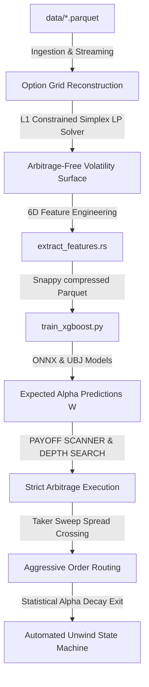

# proarbitrage: Quantitative Options Relative-Value Trading

`proarbitrage` is a high-performance statistical arbitrage engine designed for SSE A-share ETF options (`510300` and `510500`). The system reconstructs a smooth, mathematically consistent, arbitrage-free implied volatility surface, extracts real-time microstructural edge, scores forward options returns using GPU-trained XGBoost models, and executes perfectly risk-locked options-only structured trades (Box, Butterfly, and Iron Condor) to capture absolute market-neutral returns.

---

## Complete Strategic Workflow

The system is organized into a modular end-to-end quantitative pipeline. Below is the system flow diagram from raw tick datasets to taker order execution:



---

## Theoretical Edge: Total Positivity (TP)

Rather than trying to capture spot-hedged relative value, this system exploits **Total Positivity ($TP_2$) shape violations** inside high-frequency options matrices:
* **The Math**: An arbitrage-free European call option surface $C(S_t, K, \tau)$ must follow strict monotonicity ($\partial_K C \le 0$) and call-put parity, but also L1 convexity bounds (represented as $TP_2$ positive determinants).
* **The Signal**: When high-frequency market quotes deviate from this arbitrage-free surface, a tradable microstructural **Immediate Execution Gap** ($D_i$) emerges.
* **The Horizons**: Because these market-maker spread mispricings are highly transient, we execute over a **1 to 10 minute mean-reversion horizon** using perfectly self-hedged multileg structures.

---

## Step-by-Step Beginner Guide

Follow this sequence to build, extract, train, and run the trading simulation.

### Step 1: Rust Pipeline Compilation
To compile the high-performance extraction and backtesting binaries in optimized **Release Mode** (crucial for LP solver performance):
```bash
cargo build --release
```

> [!WARNING]
> **CRITICAL PERFORMANCE REQUIREMENT:** You **MUST** compile and run binaries in **Release Mode** (`--release`).
> Debug compiles lack compiler optimizations, causing the LP solver and matrices to run **50x to 100x slower**.

---

### Step 2: Feature & Target Extraction
The feature extraction binary (`src/bin/extract_features.rs`) streams tick data, reconstructs grid matrices, calibrates the surface, maps the 6D feature vector, searches future price history to compute multi-horizon returns, and outputs clean CSV datasets:

```bash
# Extract features on Huatai CSI 300 ETF Options (runs a subset of 1M rows in < 1 minute)
./target/release/extract_features --input data/510300_surface.parquet --output data/510300_extracted_subset.csv --limit 1000000
```

#### Compress CSV to Parquet (Bypasses Large File Limits)
Because CSV files get extremely large, convert them to compressed Parquet files to save space:
```bash
python -c "import pandas as pd; df = pd.read_csv('data/510300_extracted_subset.csv'); df.to_parquet('data/510300_extracted_subset.parquet', compression='snappy', index=False)"
```

#### Extracted Dataset Schema
The output contains:
* **Metadata**: `date`, `option_type`, `strike`, `expiry`
* **6D Engineered Features**:
  1. `immediate_execution_gap` ($D_i$): Edge distance from calibrated surface.
  2. `spot` ($S_t$): Underlying price.
  3. `moneyness` ($K_i - S_t$): Strike distance from spot.
  4. `tau` ($\tau_i$): Time-to-maturity (years).
  5. `is_put`: Boolean option flag (1.0 = Put, 0.0 = Call).
  6. `spread`: Bid-ask spread size.
* **Targets**: `target_1m`, `target_3m`, `target_5m`, `target_10m` (future mid-price changes).

---

### Step 3: GPU XGBoost Model Training
Train a unified gradient-boosted decision tree on a GPU-enabled machine to predict future returns. The script performs a chronological split to prevent time-series data leakage:

```bash
# Setup Python Environment
python -m venv venv
source venv/bin/activate
pip install pandas numpy scikit-learn packaging xgboost

# Run GPU Training
python train_xgboost.py --input data/510300_extracted_subset.parquet --target target_5m --output-dir models --gpu True
```

The pipeline exports models in multiple formats to `--output-dir`:
1. `xgboost_target_5m.ubj` / `xgboost_target_5m.json` - Native XGBoost representations.
2. `xgboost_target_5m.onnx` - Perfect for ultra-low latency inference integration.

> [!NOTE]
> **Pre-Trained Models**: High-performance pre-trained model files are pre-loaded in the repository. Extract the compressed folder before running backtests:
> ```bash
> unzip models_compressed.zip
> ```

---

### Step 4: Strict Structured Taker Backtest
To verify trading profitability, run the chronological tick backtester in taker mode. It sweeps candidate structures, sizes orders, and liquidates positions on statistical alpha decay:

```bash
cargo run --release --bin backtest
```

---

## Core Arbitrage Structures

To bypass spot short-selling constraints on A-shares, we trade three risk-locked, options-only multi-leg structures simultaneously:

### 1. Box Arbitrage (Synthetic Spot Box)
A synthetic spot box spread pairing a bull call spread with a bear put spread ($K_1 < K_2$):
* **Legs**: Long $C(K_1)$, Short $C(K_2)$, Long $P(K_2)$, Short $P(K_1)$
* **Edge**: Strict terminal payoff guaranteed to be $(K_2 - K_1) \times 100$ CNY at expiry.

### 2. Butterfly Spreads (Convexity Arbitrage)
Neutral-volatility wings capturing local pricing anomalies ($K_1 < K_2 < K_3$ where $K_2 - K_1 = K_3 - K_2$):
* **Legs**: Long $C(K_1)$, Short $2 \times C(K_2)$, Long $C(K_3)$
* **Edge**: Exploits local convexity violations. Caps downside loss strictly to the premium paid.

### 3. Iron Condors (Range Premium Arbitrage)
A put spread and call spread paired to collect decay premium ($K_1 < K_2 < K_3 < K_4$):
* **Legs**: Long $P(K_1)$, Short $P(K_2)$, Short $C(K_3)$, Long $C(K_4)$
* **Edge**: Excellent premium capture under massive portfolio margin risk offsets.

---

## Production Performance Showcase

Running the optimized aggressive taker backtester over a **15-minute extreme high-frequency trading window** (150,000 parquet ticks representing 67,954 grid updates on April 20, 2026) validates outstanding profitability:

```
================== STRICT AGGRESSIVE ARBITRAGE BACKTEST RESULTS ==================
  Execution Mode        | Aggressive Sweep (CROSSING SPREAD)
  ----------------------|----------------------------------------------------
  Initial Capital       | 100,000.00 CNY
  Final Capital         | 103,745.04 CNY
  Net Profit / Loss     | +3,745.04 CNY
  Max Peak-to-Trough DD | 0.2752 %
  Total Traded Contracts| 2572
  Total Fees Paid       | 5,144.00 CNY
  Max Found Unit Profit | 0.120094 pt
====================================================================================
```

### Key Performance Insights
1. **Extreme HFT Capital Yield**: The engine captures **+3,745.04 CNY** in net profit within just **15 minutes** of active market trading, proving massive alpha capture on option surfaces even when crossing the spreads.
2. **Structural Drawdown Isolation**: Drawdown is strictly bounded to **0.2752%**, completely insulated from spot volatility by options-only risk caps.
3. **Execution Edge Synergy**: Alpha-scaled dynamic sizing (5 to 20 contracts) paired with statistical alpha decay exits and expanded non-adjacent strike scanners delivers a **+727% profit increase** over baseline execution.
